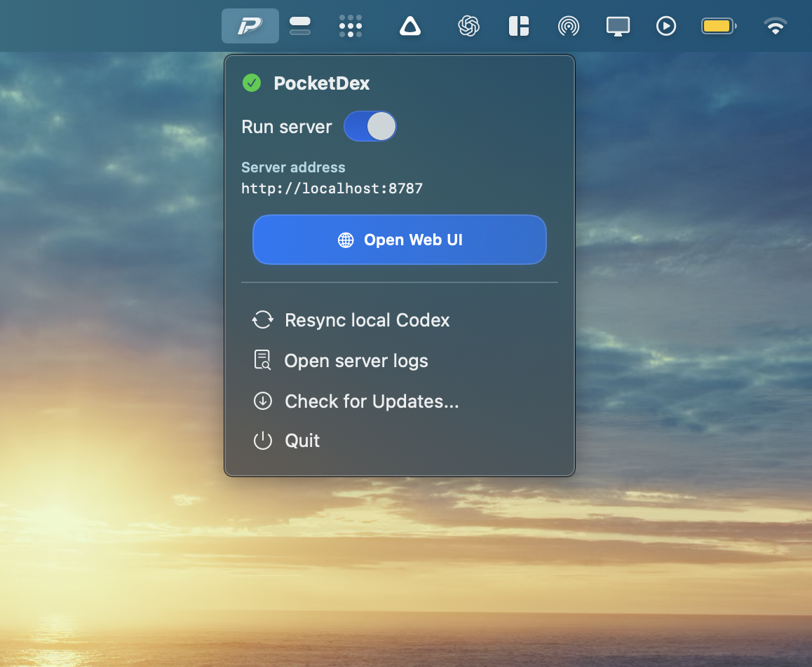
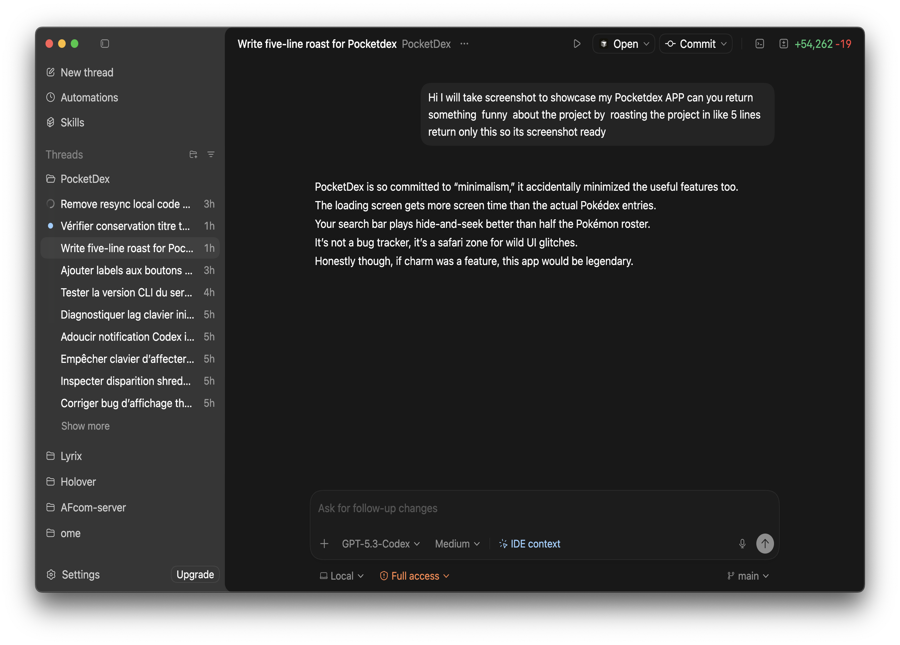
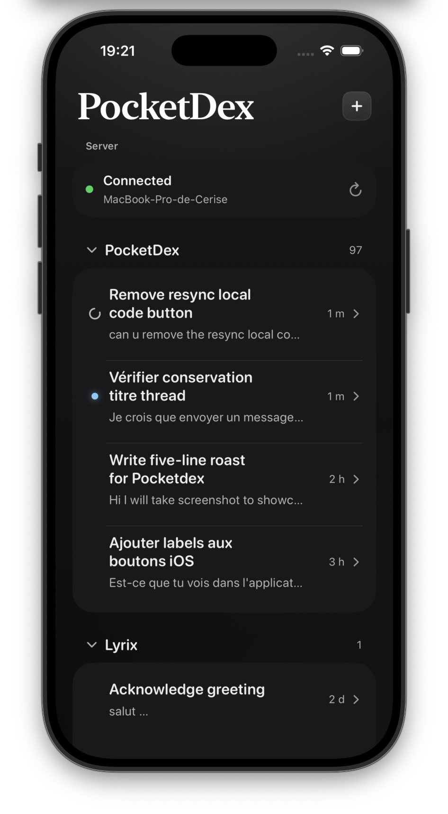
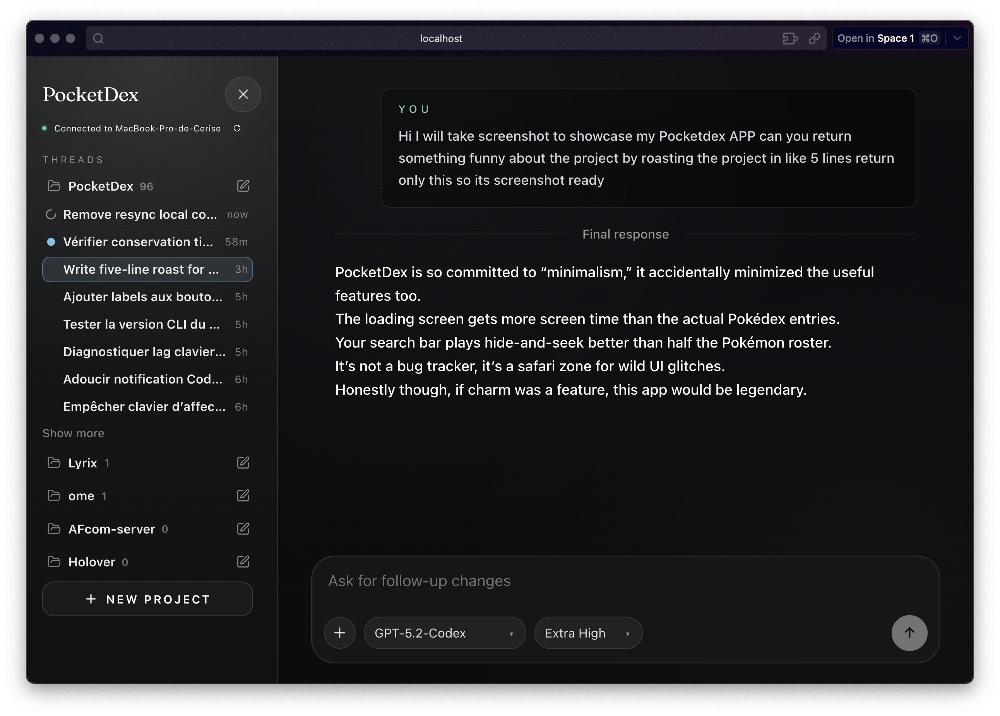

<h1 align="center">
  
  <br />
  PocketDex
</h1>

<p align="center">
  With Tailscale, you can access your local dev server from anywhere.
  <br />
  Run Codex on your Mac, then use it from Codex Desktop, Web, and iPhone.
</p>

<p align="center">
  
  <br />
  <sub><strong>PocketDex Server (Mac or CLI)</strong></sub>
</p>

<p align="center">
  
  
  
  <br />
  <sub><strong>Codex Desktop</strong></sub>&emsp;&emsp;&emsp;&emsp;&emsp;&emsp;&emsp;&emsp;&emsp;&emsp;&emsp;<sub><strong>Mobile App</strong></sub>&emsp;&emsp;&emsp;&emsp;&emsp;&emsp;&emsp;&emsp;&emsp;&emsp;<sub><strong>Web Interface</strong></sub>
</p>

## Install PocketDex (macOS)

Requirements:

- macOS machine that will host the PocketDex server ([for linux use the CLI](#pocketdex-cli-macos--linux))
- Codex app or CLI installed and logged in on that machine
- Tailscale account (only required for remote access)

Homebrew:

```bash
brew install --cask cerise1/tap/pocketdex
```

Direct installer:

```bash
curl -fsSL https://github.com/Cerise1/PocketDex/releases/latest/download/install-pocketdex-macos.sh | bash
```

Then launch `PocketDexApp` from Applications.

## How To Use (Step-by-Step)

1. Start PocketDex by opening the app (toggle on and off from the menu bar).
2. Install Tailscale on your Mac and your phone (and other client devices).
3. Sign in to Tailscale with the same account on both devices.
4. Copy your Mac Tailscale address (usually `100.x.y.z`).
5. Connect PocketDex clients using `http://<your-mac-tailscale-ip>:8787`.
6. Use your local Codex from everywhere.

> [!TIP]
> With Tailscale, you can access your local dev server from anywhere.
> Replace `localhost` with your Mac Tailscale IP and keep the same port.
> Example: `http://localhost:3000` becomes `http://100.x.y.z:3000`.
> This means you can vibe code from anywhere while testing live.

## Tailscale Setup

1. Download Tailscale on your Mac:
   - [Mac App Store](https://apps.apple.com/us/app/tailscale/id1475387142)
   - [Direct download](https://tailscale.com/download/macos)
2. Download Tailscale on your phone:
   - [iPhone (App Store)](https://apps.apple.com/us/app/tailscale/id1470499037)
3. Sign in with the same account on both devices.
4. Copy your Mac Tailscale IP address.
5. Paste it into PocketDex as `http://<your-mac-tailscale-ip>:8787`.

## PocketDex CLI (macOS / Linux)

If you want server mode without the macOS app, use the CLI:

```bash
git clone https://github.com/Cerise1/PocketDex.git
cd PocketDex
./scripts/install-pocketdex.sh
pocketdex start
pocketdex status
```

Update CLI after a new version:

```bash
git pull
./scripts/install-pocketdex.sh
pocketdex restart
```

## What Is Included

- `PocketDexApp/`: native macOS menu bar app (SwiftUI)
- `PocketDexMobile/`: native iOS mobile app (SwiftUI)
- `server/`: Node.js API and Codex bridge
- `web/`: web client
- `scripts/`: install/build automation

## Documentation

- [Docs index](docs/README.md)
- [Development](docs/development.md)
- [Architecture](docs/architecture.md)
- [Codex desktop live sync](docs/codex_desktop_live_sync.md)
- [Desktop sync investigation notes](docs/codex_desktop_sync_investigation.md)
